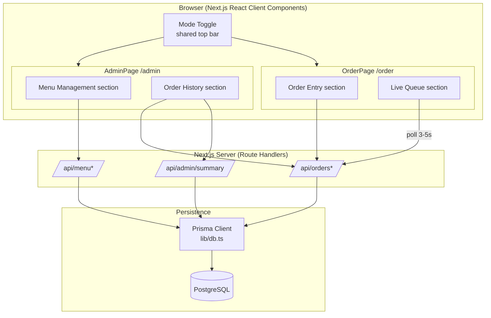

# Design Document: Coffee Shop Ordering System

## Overview

The Coffee Shop Ordering System is an internal, staff-only ordering/POS tool for a small coffee shop. It is not a customer-facing storefront: staff take orders in person at the counter and enter them into the system. The system tracks orders, payment status (Cash or GCash, confirmed manually with a single tap), and order progress through a fixed lifecycle (Received → Preparing → Ready → Completed, or Cancelled).

The application is a single Next.js (App Router) project written in TypeScript, combining the frontend UI and backend API route handlers. Data is persisted in PostgreSQL through Prisma. This v1 prototype has **no authentication**: there is no login page, no session cookies, and no roles. It is an internal tool intended to run on a single shared device at the counter, and navigation between the two screens is handled entirely by a client-side mode toggle. The live order queue refreshes via short-interval polling rather than a realtime subscription, which keeps v1 simple for staff on local wifi. Orders follow a simplified lifecycle: Pending → Ready → Completed (or Cancelled).

The design prioritizes a lean, working end-to-end prototype. All monetary values are stored as integer centavos and formatted to pesos only at display time. All authoritative price totals and daily order numbers are computed server-side; the client never sends a total. The UI is collapsed into exactly two pages — an order-taking page and an admin page — each split into two internal sections, with menu management and server-computed order history (day, week, and month views) living on the admin page.

## Architecture



**Key architectural decisions:**

- **Single Next.js project**: Frontend pages and backend API route handlers live in one codebase (App Router). Deployed to Vercel with Vercel Postgres.
- **Server-side authority**: Price totals (`totalPriceCents`), daily order numbers (`dailyNumber`), and history aggregates are always computed on the server. The client-side running total on the order-entry section is display-only.
- **No authentication in v1**: This prototype has no login, no session cookies, and no roles. It is intended to run on a single internal device at the counter, so any request may call any API route. Navigation between the two pages is handled by a client-side mode toggle in a shared top bar. Authentication is deliberately deferred to a later version.
- **Two-page UI with mode toggle**: The entire UI is collapsed into two pages — `/order` (Order Entry + Live Queue) and `/admin` (Menu Management + Order History) — switched by a top-bar mode toggle. The root route `/` redirects to `/order`.
- **Polling over realtime**: The live queue polls `GET /api/orders` every 3–5 seconds instead of using a realtime subscription.
- **Time zone anchoring**: The business day boundary for `dailyNumber` and history is 2 AM Asia/Manila.

## Components and Interfaces

### Component 1: Menu Service (`lib/menu.ts`)

**Purpose**: Read and mutate menu items, sizes, and add-ons.

**Interface**:

```typescript
interface MenuService {
  listMenu(): Promise<MenuItem[]>;            // includes sizes + addOns
  createMenuItem(input: MenuItemInput): Promise<MenuItem>;
  updateMenuItem(id: string, input: Partial<MenuItemInput>): Promise<MenuItem>;
  deleteMenuItem(id: string): Promise<void>;  // remove item (and cascade variants)
}

type MenuItemInput = {
  name: string;
  description?: string;
  basePriceCents: number;   // integer centavos, >= 0
  category: string;
  imageUrl?: string;
  available: boolean;
  sizes: { name: string; priceDeltaCents: number }[];
  addOns: { name: string; priceCents: number; available: boolean }[];
};
```

**Responsibilities**:
- Provide the full menu (with sizes and add-ons) for the order-entry section.
- Support admin CRUD on items, sizes, and add-ons.
- Support toggling `available` on both a whole `MenuItem` and an individual `MenuItemAddOn`.

### Component 2: Order Service (`lib/orders.ts`)

**Purpose**: Create, read, update, and cancel orders; own the authoritative price and daily-number computations.

**Interface**:

```typescript
interface OrderService {
  // Computes dailyNumber and totalPriceCents server-side; client never sends a total.
  createOrder(input: CreateOrderInput): Promise<Order>;
  // date defaults to "today" (Asia/Manila) for the live queue.
  listOrders(date?: string): Promise<Order[]>;
  // Status change, mark-paid, or item edits (item edits only while PENDING).
  updateOrder(id: string, patch: OrderPatch): Promise<Order>;
  // Cancel; if order isPaid, sets refunded = true.
  cancelOrder(id: string): Promise<Order>;
}

type CreateOrderInput = {
  customerName?: string;
  paymentMethod: PaymentMethod; // "CASH" | "GCASH"
  items: {
    menuItemId: string;
    sizeId?: string;
    quantity: number;           // integer >= 1
    notes?: string;
    addOnIds: string[];
  }[];
};

type OrderPatch =
  | { kind: "status"; status: OrderStatus }
  | { kind: "payment"; isPaid: true; paymentRef?: string }
  | { kind: "items"; items: CreateOrderInput["items"] }; // rejected unless status === PENDING
```

**Responsibilities**:
- Compute `totalPriceCents` = Σ over items of `quantity × (basePriceCents + sizeDeltaCents + Σ addOn priceCents)`.
- Compute `dailyNumber` as (count of today's orders) + 1 at creation.
- Enforce that item/quantity/notes edits are only applied while `status === PENDING`; reject otherwise.
- Freeze `totalPriceCents` as a snapshot at creation and recompute it on item edits.
- On cancellation, set `status = CANCELLED` and set `refunded = true` when the order was already paid.

### Component 3: Summary Service (`lib/summary.ts`)

**Purpose**: Produce server-computed history aggregates for day/week/month views.

**Interface**:

```typescript
type SummaryView = "day" | "week" | "month";

interface SummaryService {
  getSummary(view: SummaryView, anchorDate: string): Promise<Summary>;
}

type Summary = {
  view: SummaryView;
  startDate: string;   // YYYY-MM-DD (Asia/Manila)
  endDate: string;     // YYYY-MM-DD
  totalOrders: number;
  cancelledOrders: number;
  revenueCents: number;      // excludes refunded + cancelled-unpaid
  refundedCents: number;     // separate line
  cashCents: number;
  gcashCents: number;
  dailyBreakdown: { date: string; orders: number; revenueCents: number }[];
};
```

**Responsibilities**:
- Compute aggregates in PostgreSQL (SUM / COUNT / GROUP BY DATE) via Prisma, not client-side.
- Exclude refunded orders from `revenueCents` (report them in `refundedCents`).
- Treat cancelled-unpaid orders as ₱0 revenue while still counting them in `totalOrders`/`cancelledOrders` so order numbering has no unexplained gaps.
- Snap week ranges to Monday–Sunday and month ranges to calendar months, using the 2 AM Asia/Manila day boundary.

### Component 4: UI Pages

**Purpose**: Deliver the staff-facing screens as exactly two pages, switched by a client-side mode toggle in a shared top bar. There is no authentication gate between them.

**Shared top bar (mode toggle)**:
- A persistent top bar renders a mode toggle that switches between "Order-taking mode" (navigates to `/order`) and "Admin mode" (navigates to `/admin`).
- The root route `/` redirects to `/order`.

**Page A — Order-taking page (`/order`)**: a single page containing two sections/tabs.
- **(a) Order Entry**: category-organized menu picker with size/add-on selection, quantity, notes, an optional customer name, and a display-only live running total. Includes the single-tap payment confirmation step (Cash/GCash, with an optional GCash reference) that submits `POST /api/orders`.
- **(b) Live Queue**: polls `GET /api/orders` every 3–5s; staff advance status (PENDING → READY → COMPLETED) and cancel orders. Active orders (PENDING/READY) are displayed prominently with action buttons; completed/cancelled orders remain visible below for the rest of the day.

**Page B — Admin page (`/admin`)**: a single page containing two sections/tabs.
- **(a) Menu Management**: CRUD on menu items, sizes, and add-ons, including `available` toggles.
- **(b) Order History**: day/week/month views. Day view shows summary cards plus a full per-order table; week view shows summary cards plus a per-day list; month view shows summary cards plus a Recharts bar chart. Period-navigation arrows shift the anchor date by one period; clicking a day in the week/month view drills down to that day view.

## Data Models

Prices are stored as integer centavos everywhere. Enums:

```typescript
enum OrderStatus { PENDING, READY, COMPLETED, CANCELLED }
enum PaymentMethod { CASH, GCASH }
```

### Model: MenuItem

```typescript
interface MenuItem {
  id: string;
  name: string;
  description?: string;
  basePriceCents: number;   // Int centavos
  category: string;
  imageUrl?: string;
  available: boolean;       // default true
  createdAt: Date;
  sizes: MenuItemSize[];
  addOns: MenuItemAddOn[];
}
```

**Validation Rules**:
- `name` non-empty; `basePriceCents` is an integer ≥ 0.
- `category` non-empty.
- `available` defaults to true.

### Model: MenuItemSize

```typescript
interface MenuItemSize {
  id: string;
  menuItemId: string;
  name: string;
  priceDeltaCents: number;  // Int, default 0 (may be negative for a discount size)
}
```

**Validation Rules**:
- `name` non-empty; `priceDeltaCents` is an integer.

### Model: MenuItemAddOn

```typescript
interface MenuItemAddOn {
  id: string;
  menuItemId: string;
  name: string;
  priceCents: number;       // Int, default 0, >= 0
  available: boolean;       // default true
}
```

**Validation Rules**:
- `name` non-empty; `priceCents` is an integer ≥ 0.
- `available` toggles a single add-on independent of the parent item.

### Model: Order

```typescript
interface Order {
  id: string;
  dailyNumber: number;      // resets to 1 each day at 2 AM Asia/Manila
  customerName?: string;
  status: OrderStatus;      // default RECEIVED
  paymentMethod: PaymentMethod;
  paymentRef?: string;      // optional for both methods
  isPaid: boolean;          // default false
  refunded: boolean;        // default false
  totalPriceCents: number;  // Int, server-computed frozen snapshot
  createdAt: Date;
  updatedAt: Date;
  items: OrderItem[];
}
```

**Validation Rules**:
- `totalPriceCents` is always server-computed, never accepted from the client.
- `dailyNumber` ≥ 1, computed as count of today's orders + 1.
- `refunded` may only be true when `isPaid` was true at cancellation time.
- Item edits allowed only while `status === PENDING`.

### Model: OrderItem

```typescript
interface OrderItem {
  id: string;
  orderId: string;
  menuItemId: string;
  sizeId?: string;
  quantity: number;         // integer >= 1
  notes?: string;
  addOns: OrderItemAddOn[];
}
```

**Validation Rules**:
- `quantity` is an integer ≥ 1.
- `sizeId`, if present, must belong to the referenced `menuItemId`.

### Model: OrderItemAddOn

```typescript
interface OrderItemAddOn {
  id: string;
  orderItemId: string;
  addOnId: string;
}
```

**Validation Rules**:
- `addOnId` must reference an add-on belonging to the item's `menuItemId`.

## Error Handling

### Error Scenario 1: Editing an order past PENDING

**Condition**: `PATCH /api/orders/[id]` with an items patch when current status is `READY` or beyond.
**Response**: Handler re-reads current status and returns `409 Conflict` without applying edits.
**Recovery**: Staff may still change status; item edits are blocked by design.

### Error Scenario 2: Invalid order payload

**Condition**: Empty items list, `quantity < 1`, unknown `menuItemId`/`sizeId`/`addOnId`, or a client-supplied total.
**Response**: `POST /api/orders` / `PATCH` returns `400` with validation detail; the server ignores any client-provided total.
**Recovery**: Client corrects and resubmits.

### Error Scenario 3: Cancelling an order

**Condition**: `DELETE /api/orders/[id]`.
**Response**: Sets `status = CANCELLED`; if `isPaid` was true, sets `refunded = true`. Order remains in the queue for the rest of the day and in history/order numbering.
**Recovery**: N/A — cancellation is terminal.

## API Routes

All routes are plain Next.js route handlers. **In this v1 prototype none of these routes are behind authentication** — there is no auth gating or "admin only" restriction; any request from the single internal device may call them.

| Route | Methods | Purpose |
| --- | --- | --- |
| `/api/menu` | GET, POST | List the full menu; create a menu item. |
| `/api/menu/[id]` | PATCH, DELETE | Update or delete a menu item (and its variants). |
| `/api/orders` | GET, POST | List today's orders (queue polling); create an order. |
| `/api/orders/[id]` | PATCH, DELETE | Update status/payment/items; cancel (with refund flag). |
| `/api/admin/summary` | GET | Server-computed day/week/month history aggregates. |

## Testing Strategy

### Unit Testing Approach

Unit tests cover concrete examples and edge cases in the pure logic layer: price computation with base + size delta + add-ons, `dailyNumber` computation, the PENDING-only edit guard, refunded-flag logic on cancellation, and summary revenue exclusion rules. UI components are covered with example-based render/interaction tests (order-entry running total, queue status transitions).

### Property-Based Testing Approach

Property-based tests target the pure, input-varying logic: order total computation, the edit-guard invariant, cancellation/refund invariants, and summary aggregation invariants. Tests mock the Prisma layer (or use in-memory fixtures) so 100+ iterations stay cheap and isolate business logic from I/O.

**Property Test Library**: fast-check (TypeScript).

### Integration Testing Approach

A small number of integration tests exercise the API route handlers against a test database (or a mocked Prisma client): create order → advance status → mark paid → cancel/refund, and a summary query across a seeded set of orders. These use 1–3 representative scenarios rather than heavy iteration.

## Performance Considerations

- The live queue polls every 3–5 seconds; queries are scoped to a single business day, keeping result sets small.
- History aggregates are computed in PostgreSQL (SUM/COUNT/GROUP BY DATE) rather than transferring raw rows to the client.
- Prices are integer arithmetic (centavos), avoiding floating-point/decimal overhead.

## Security Considerations

- **This v1 prototype has no authentication.** There are no passwords, no session cookies, and no server-side route protection. Any request may call any API route. This is an accepted tradeoff because the tool is an internal, single-device counter application; authentication and access control are deferred to a later version.
- Authoritative totals and daily numbers are computed server-side; the client cannot influence pricing, which remains true regardless of the absence of authentication.

## Dependencies

- **Next.js** (App Router) — frontend + API route handlers.
- **TypeScript** — language.
- **PostgreSQL** — database (Vercel Postgres in production).
- **Prisma** — ORM and migrations.
- **Tailwind CSS** — styling.
- **Recharts** — daily-revenue bar chart on the month history view.
- **fast-check** — property-based testing (dev).
- A test runner (e.g., Vitest or Jest) — unit/integration tests (dev).

## Correctness Properties

_A property is a characteristic or behavior that should hold true across all valid executions of a system — essentially, a formal statement about what the system should do. Properties serve as the bridge between human-readable specifications and machine-verifiable correctness guarantees._

### Property 1: Order total server authority

*For any* order composed of a non-empty list of items (each with a base-priced menu item, an optional size delta, a quantity ≥ 1, and any number of add-ons), the server-computed `totalPriceCents` equals `Σ over items of quantity × (basePriceCents + sizeDeltaCents + Σ addOn priceCents)`, and this result is independent of any total value supplied by the client.

**Validates: Requirements 4.1, 4.2, 4.3, 11.3**

### Property 2: Daily number is sequential within a business day

*For any* sequence of N orders created within the same Business_Day (2 AM Asia/Manila boundary), the orders receive `dailyNumber` values 1, 2, …, N in creation order with no gaps, and the first order created after a 2 AM Asia/Manila boundary receives `dailyNumber` 1. Cancelled orders retain their assigned number and continue to count toward the sequence.

**Validates: Requirements 4.4, 4.5, 7.4**

### Property 3: PENDING-only edit guard

*For any* order whose current stored status is not `PENDING` (i.e., `READY`, `COMPLETED`, or `CANCELLED`), an items/quantities/notes edit is rejected with HTTP 409 and leaves the order's items and `totalPriceCents` unchanged; and *for any* order whose status is `PENDING`, an accepted items edit recomputes `totalPriceCents` using the same formula as Property 1.

**Validates: Requirements 6.1, 6.2, 6.3, 6.4**

### Property 4: Cancellation and refund invariant

*For any* order, after cancellation the order's status is `CANCELLED` and its `refunded` flag is true if and only if the order's `isPaid` was true at cancellation time.

**Validates: Requirements 7.1, 7.2, 7.3**

### Property 5: Summary revenue exclusion and aggregation

*For any* set of orders in a summary range, `revenueCents` equals the sum of `totalPriceCents` over orders that are neither refunded nor cancelled-unpaid; `refundedCents` equals the sum of `totalPriceCents` over refunded orders and is disjoint from `revenueCents`; `totalOrders` and `cancelledOrders` count all orders (including cancelled ones); and the per-day breakdown reconciles so that the sum of daily revenue equals `revenueCents` and the sum of daily order counts equals `totalOrders`.

**Validates: Requirements 9.1, 9.3, 9.4, 9.5, 9.8**

### Property 6: History range snapping

*For any* anchor date, a `week` summary range starts on the Monday and ends on the Sunday enclosing that date, and a `month` summary range spans the first through the last day of that anchor date's calendar month, both computed using the 2 AM Asia/Manila Business_Day boundary.

**Validates: Requirements 9.6, 9.7**

### Property 7: Add-on availability independence

*For any* menu item and one of its add-ons, toggling the add-on's `available` flag changes only that add-on's availability and leaves the parent item's `available` flag unchanged.

**Validates: Requirements 2.6**

### Property 8: Client running total matches server formula

*For any* order selection composed on the order-entry section, the client-side display-only running total equals the server-authoritative total that Property 1 computes for the same selection.

**Validates: Requirements 3.4, 3.5**

### Property 9: Day-scoped queue visibility

*For any* order belonging to the current Business_Day, including orders whose status is `COMPLETED` or `CANCELLED`, a queue request without a date returns that order for the remainder of that Business_Day.

**Validates: Requirements 5.2, 5.5**
