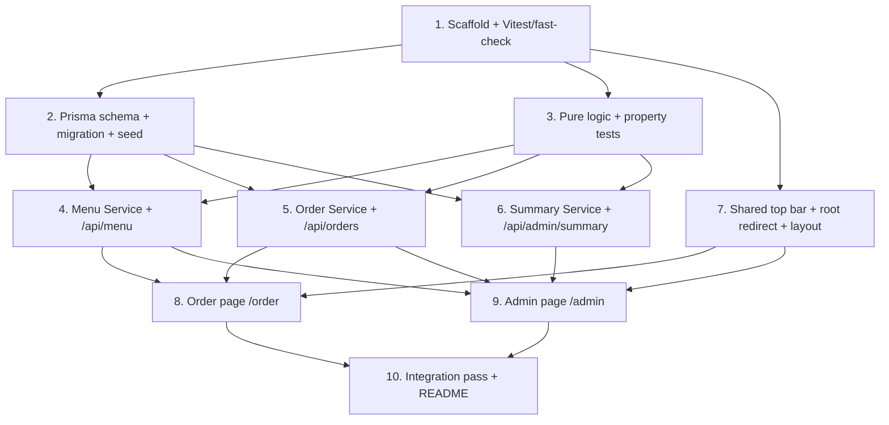

# Implementation Plan: Coffee Shop Ordering System

## Overview

This plan builds a quick working prototype of the internal, no-auth coffee shop POS as a single Next.js (App Router) + TypeScript project. Persistence is PostgreSQL via Prisma; styling is Tailwind CSS; the month history chart uses Recharts. Pure business logic (pricing, daily numbering, edit guard, cancellation/refund, summary aggregation, range snapping) is extracted into testable modules and covered by fast-check property tests (run under Vitest) before being wired into API route handlers and the two UI pages (`/order` and `/admin`).

The build order is bottom-up: scaffold → schema/seed → pure logic + property tests → services + API routes → shared layout → order page → admin page → integration + README. Each task builds on prior steps so nothing is left orphaned.

## Task Dependency Graph

```json
{
  "waves": [
    { "wave": 1, "tasks": ["1"] },
    { "wave": 2, "tasks": ["2", "3", "7"] },
    { "wave": 3, "tasks": ["4", "5", "6"] },
    { "wave": 4, "tasks": ["8", "9"] },
    { "wave": 5, "tasks": ["10"] },
    { "wave": 6, "tasks": ["11"] }
  ]
}
```



## Tasks

- [ ] 1. Scaffold project and test tooling
  - Initialize a Next.js (App Router) + TypeScript project with Tailwind CSS configured (globals, `tailwind.config`, PostCSS).
  - Add dependencies: `prisma`, `@prisma/client`, `recharts`; dev dependencies: `vitest`, `fast-check`, and any TS test config.
  - Create `lib/db.ts` exporting a singleton Prisma client (guarded against hot-reload duplication in dev).
  - Add `vitest.config.ts` and an `npm test` script; add a trivial passing sanity test to confirm Vitest + fast-check run.
  - _Requirements: 1.1_

- [ ] 2. Define data model, migration, and seed
  - [ ] 2.1 Write the Prisma schema
    - Define models `MenuItem`, `MenuItemSize`, `MenuItemAddOn`, `Order`, `OrderItem`, `OrderItemAddOn` with all fields and relations from the design (integer centavos for all money fields, cascade delete from `MenuItem` to sizes/add-ons and from `Order` to items/add-ons).
    - Define enums `OrderStatus` (PENDING, READY, COMPLETED, CANCELLED) and `PaymentMethod` (CASH, GCASH). Do NOT add any staff/user/role models.
    - Set defaults: `MenuItem.available = true`, `MenuItemAddOn.available = true`, `MenuItemSize.priceDeltaCents = 0`, `Order.status = PENDING`, `Order.isPaid = false`, `Order.refunded = false`.
    - _Requirements: 2.1, 4.8, 8.3, 11.1_
  - [ ] 2.2 Generate the first migration
    - Run the initial Prisma migration against a local PostgreSQL database and generate the client.
    - _Requirements: 11.1_
  - [ ] 2.3 Write a seed script with placeholder menu data
    - Seed several categories, menu items with base prices (centavos), sizes with price deltas, and add-ons with prices and availability flags. Seed no orders and no staff accounts.
    - _Requirements: 2.1_

- [ ] 3. Implement pure business-logic modules with property tests
  - [ ] 3.1 Implement price/total computation (`lib/pricing.ts`)
    - Write pure functions to compute a single item's line total and an order's `totalPriceCents` as `Σ quantity × (basePriceCents + sizeDeltaCents + Σ addOn priceCents)` over resolved menu data. Client-supplied totals are never an input.
    - _Requirements: 4.1, 4.2, 4.3, 11.3_
  - [ ]* 3.2 Write property test for total computation
    - **Property 1: Order total server authority**
    - **Validates: Requirements 4.1, 4.2, 4.3, 11.3**
  - [ ]* 3.3 Write property test for client/server total agreement
    - Assert the display-only running-total function and the server total function produce identical values for the same selection.
    - **Property 8: Client running total matches server formula**
    - **Validates: Requirements 3.4, 3.5**
  - [ ] 3.4 Implement Business_Day + daily number logic (`lib/businessDay.ts`)
    - Write pure functions that map a timestamp to its Business_Day (2 AM Asia/Manila boundary) and compute the next `dailyNumber` from a count of that day's existing orders + 1.
    - _Requirements: 4.4, 4.5, 7.4_
  - [ ]* 3.5 Write property test for sequential daily numbering
    - **Property 2: Daily number is sequential within a business day**
    - **Validates: Requirements 4.4, 4.5, 7.4**
  - [ ] 3.6 Implement PENDING-only edit guard (`lib/orderRules.ts`)
    - Write a pure guard that, given a current stored status and a requested items edit, decides accept (only when PENDING) vs reject, and recomputes the total via `lib/pricing.ts` when accepted.
    - _Requirements: 6.1, 6.2, 6.3, 6.4_
  - [ ]* 3.7 Write property test for the edit guard invariant
    - **Property 3: PENDING-only edit guard**
    - **Validates: Requirements 6.1, 6.2, 6.3, 6.4**
  - [ ] 3.8 Implement cancellation/refund logic (`lib/orderRules.ts`)
    - Write a pure function that, given an order's `isPaid` state, returns the post-cancellation state (`status = CANCELLED`, `refunded = isPaid`).
    - _Requirements: 7.1, 7.2, 7.3_
  - [ ]* 3.9 Write property test for cancellation/refund invariant
    - **Property 4: Cancellation and refund invariant**
    - **Validates: Requirements 7.1, 7.2, 7.3**
  - [ ] 3.10 Implement summary aggregation (`lib/summaryLogic.ts`)
    - Write pure functions that, given a set of order records, compute `revenueCents` (excluding refunded and cancelled-unpaid), `refundedCents`, `totalOrders`, `cancelledOrders`, `cashCents`/`gcashCents`, and the per-day breakdown.
    - _Requirements: 9.3, 9.4, 9.5, 9.8_
  - [ ]* 3.11 Write property test for summary revenue exclusion and reconciliation
    - **Property 5: Summary revenue exclusion and aggregation**
    - **Validates: Requirements 9.1, 9.3, 9.4, 9.5, 9.8**
  - [ ] 3.12 Implement week/month range snapping (`lib/summaryLogic.ts`)
    - Write pure functions that snap an anchor date to a Monday–Sunday week range and to a calendar-month range using the 2 AM Asia/Manila boundary.
    - _Requirements: 9.6, 9.7_
  - [ ]* 3.13 Write property test for range snapping
    - **Property 6: History range snapping**
    - **Validates: Requirements 9.6, 9.7**
  - [ ]* 3.14 Write property test for add-on availability independence
    - Using an in-memory menu-item fixture, assert toggling an add-on's `available` flag changes only that add-on and leaves the parent item's `available` unchanged.
    - **Property 7: Add-on availability independence**
    - **Validates: Requirements 2.6**

- [ ] 4. Implement Menu Service and menu API routes
  - [ ] 4.1 Implement `lib/menu.ts` (Menu Service)
    - Implement `listMenu`, `createMenuItem`, `updateMenuItem`, `deleteMenuItem` over Prisma, including nested sizes/add-ons, `available` toggles for item and individual add-on (Property 7 behavior), and input validation (non-empty name/category, integer `basePriceCents ≥ 0`, integer `priceDeltaCents`, integer `priceCents ≥ 0`).
    - _Requirements: 2.1, 2.2, 2.3, 2.4, 2.5, 2.6, 2.7, 2.8_
  - [ ] 4.2 Implement `/api/menu` route handler (GET, POST)
    - GET returns the full menu with sizes and add-ons; POST validates and creates a menu item, returning 400 on invalid input.
    - _Requirements: 2.1, 2.2, 2.7, 2.8_
  - [ ] 4.3 Implement `/api/menu/[id]` route handler (PATCH, DELETE)
    - PATCH updates item/sizes/add-ons and availability toggles; DELETE removes the item and cascades to variants.
    - _Requirements: 2.3, 2.4, 2.5, 2.6_
  - [ ]* 4.4 Write unit tests for menu validation and cascade delete
    - Cover invalid inputs (empty name/category, negative prices) and cascade removal of sizes/add-ons.
    - _Requirements: 2.4, 2.7, 2.8_

- [ ] 5. Implement Order Service and order API routes
  - [ ] 5.1 Implement `lib/orders.ts` (Order Service)
    - Implement `createOrder` (resolve menu data, validate items, compute `totalPriceCents` via `lib/pricing.ts`, compute `dailyNumber` via `lib/businessDay.ts`, set status `PENDING`, ignore any client total), `listOrders(date?)` (default to current Business_Day), `updateOrder` (status change, mark-paid with optional GCash `paymentRef`, and items edit gated by the PENDING-only guard from `lib/orderRules.ts` with total recompute), and `cancelOrder` (apply cancellation/refund logic).
    - _Requirements: 4.1, 4.2, 4.3, 4.4, 4.5, 4.8, 5.2, 6.1, 6.3, 6.4, 7.1, 7.2, 7.3, 7.4, 8.1, 8.2, 8.3_
  - [ ] 5.2 Implement `/api/orders` route handler (GET, POST)
    - GET returns current Business_Day orders (used by queue polling); POST creates an order with server-computed total and daily number, returning 400 for empty items, `quantity < 1`, unknown or mismatched `menuItemId`/`sizeId`/`addOnId`.
    - _Requirements: 4.1, 4.4, 4.6, 4.7, 4.8, 5.2_
  - [ ] 5.3 Implement `/api/orders/[id]` route handler (PATCH, DELETE)
    - PATCH handles status advancement, payment confirmation, and items edits — re-reading current stored status and returning 409 when an items edit is attempted past PENDING; DELETE cancels the order and sets `refunded` when it was paid, keeping it counted in daily numbering.
    - _Requirements: 5.3, 5.4, 6.1, 6.2, 6.3, 6.4, 7.1, 7.2, 7.3, 7.4, 8.1, 8.2_
  - [ ]* 5.4 Write unit tests for order creation validation and 409 edit guard
    - Cover 400 cases (empty items, quantity < 1, unknown/mismatched references, ignored client total) and the 409 response for an items edit while `READY`.
    - _Requirements: 4.6, 4.7, 6.2_

- [ ] 6. Implement Summary Service and summary API route
  - [ ] 6.1 Implement `lib/summary.ts` (Summary Service)
    - Implement `getSummary(view, anchorDate)` using range snapping from `lib/summaryLogic.ts` and Prisma aggregate/`groupBy` for server-side SUM/COUNT/GROUP BY DATE, returning the `Summary` shape (revenue excluding refunded + cancelled-unpaid, separate `refundedCents`, cash/gcash splits, per-day breakdown).
    - _Requirements: 9.1, 9.2, 9.3, 9.4, 9.5, 9.6, 9.7, 9.8_
  - [ ] 6.2 Implement `/api/admin/summary` route handler (GET)
    - Parse `view` (day/week/month) and `anchorDate` query params and return the computed summary; validate the view value.
    - _Requirements: 9.1, 9.2_
  - [ ]* 6.3 Write integration test for summary over seeded orders
    - Seed a small set of orders (including one refunded and one cancelled-unpaid) and assert day/week/month aggregates reconcile.
    - _Requirements: 9.3, 9.5, 9.8_

- [ ] 7. Build shared layout, mode toggle, and root redirect
  - Implement the shared top bar with the Mode_Toggle that navigates between `/order` and `/admin`, applied via the App Router root layout with Tailwind styling.
  - Implement the root route `/` to redirect to `/order`.
  - _Requirements: 1.1, 1.4, 1.5, 1.6, 11.2_

- [ ] 8. Build the Order-taking page (`/order`)
  - [ ] 8.1 Implement the Order Entry section
    - Fetch the menu from `/api/menu`; render items by category with size, add-on, quantity, per-item notes, and optional customer name selection; show a display-only client running total (using the shared pricing function, never sent to the server); provide single-tap Cash/GCash payment confirmation with optional GCash reference that submits `POST /api/orders`.
    - _Requirements: 3.1, 3.2, 3.3, 3.4, 3.5, 3.6, 8.1, 8.2, 11.2_
  - [ ]* 8.2 Write component test for the running total display
    - Assert the rendered running total matches the shared formula for a composed selection and is not included in the submit payload.
    - _Requirements: 3.4, 3.5_
  - [ ] 8.3 Implement the Live Queue section
    - Poll `GET /api/orders` every 3–5 seconds; render current Business_Day orders split into active (PENDING/READY with action buttons) and completed/cancelled sections; provide controls to advance status (PENDING → READY → COMPLETED) and to cancel; keep COMPLETED/CANCELLED orders visible for the remainder of the Business_Day.
    - _Requirements: 5.1, 5.2, 5.3, 5.4, 5.5_
  - [ ]* 8.4 Write property test for day-scoped queue visibility
    - Using order fixtures across statuses, assert an undated queue query returns all current-Business_Day orders including COMPLETED and CANCELLED.
    - **Property 9: Day-scoped queue visibility**
    - **Validates: Requirements 5.2, 5.5**

- [ ] 9. Build the Admin page (`/admin`)
  - [ ] 9.1 Implement the Menu Management section
    - Provide CRUD UI over `/api/menu` and `/api/menu/[id]` for items, sizes, and add-ons, including `available` toggles for both items and individual add-ons.
    - _Requirements: 2.2, 2.3, 2.4, 2.5, 2.6_
  - [ ] 9.2 Implement the Order History section
    - Fetch `/api/admin/summary`; render the day view (summary card + per-order table), week view (summary card + per-day list), and month view (summary card + Recharts daily-revenue bar chart); provide period-navigation arrows and drill-down from a week/month day into the day view. Format all money in pesos from centavos.
    - _Requirements: 9.1, 10.1, 10.2, 10.3, 10.4, 10.5, 11.2_

- [ ] 10. Integration pass and README
  - [ ] 10.1 Wire and verify the end-to-end flow
    - Confirm navigation via the mode toggle, order creation → queue advance → mark paid → cancel/refund, menu edits reflecting on the order-entry section, and history views rendering; fix any integration gaps.
    - _Requirements: 1.4, 4.1, 5.4, 7.1, 9.1_
  - [ ]* 10.2 Write an integration test for the order lifecycle
    - Exercise create → advance status → mark paid → cancel/refund against a test database or mocked Prisma client.
    - _Requirements: 4.1, 5.4, 7.2, 8.1_
  - [ ] 10.3 Write the README
    - Document setup: `DATABASE_URL` env var, `prisma migrate` and seed commands, and running the dev server.
    - _Requirements: 1.1_

- [ ] 11. Final checkpoint - Ensure all tests pass
  - Ensure all unit, property, and integration tests pass, ask the user if questions arise.

## Notes

- Tasks marked with `*` are optional test sub-tasks and can be skipped for a faster MVP; core implementation tasks are never optional.
- Property tests target the design's Correctness Properties and run a minimum of 100 iterations under fast-check + Vitest, tagged `Feature: coffee-shop-ordering-system, Property {number}: {property_text}`.
- Each task references specific requirement clauses for traceability.
- Property tests validate universal correctness properties; unit/integration tests validate specific examples, edge cases, and wiring.
- This is a no-auth v1 prototype: there are no staff/user/role models, no login, and no route protection.
